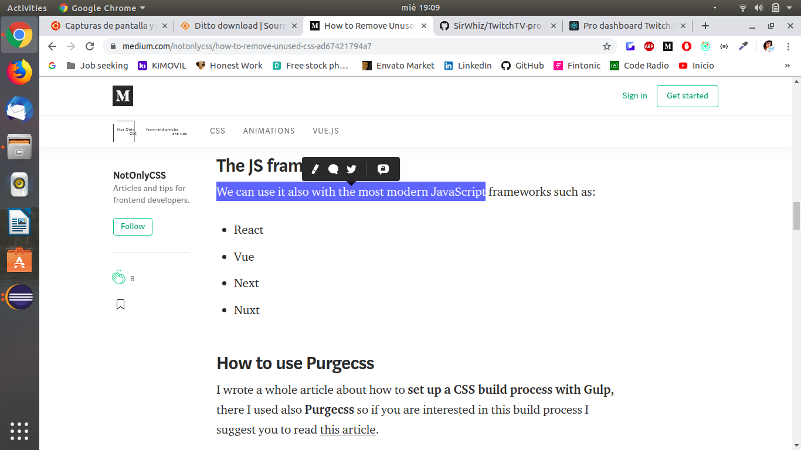

# Clipboard Manager
ClipboardManager is a Java appplication that helps you remember everything that you have copied to your clipboard.

## Screenshots:

## Contributing
All pull requests are welcome.

## License
[MIT](https://choosealicense.com/licenses/mit/)
